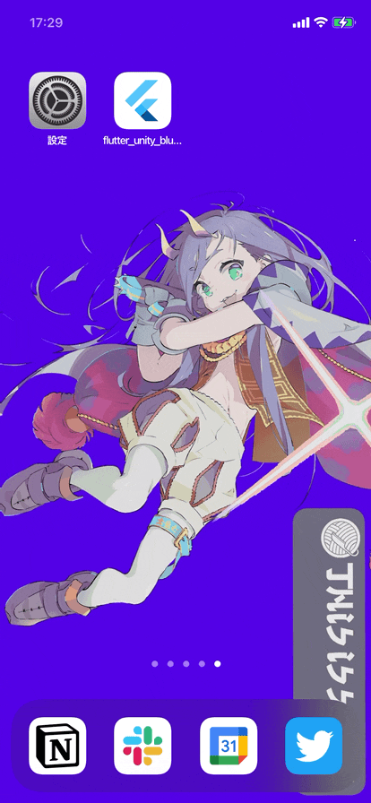

# flutter_unity_blueprints

A template for flutter app with UaaL.

## Getting Started

1. move to project root
2. `make setup`
3. `cd unity/flutter_unity_blueprints_unity && make build-unity-ios`
4. `flutter run --flavor development`

# References

- [Protocol Buffers](https://protobuf.dev/)
  - state sync between flutter and unity
- [flutter-unity-view-widget](https://github.com/juicycleff/flutter-unity-view-widget/tree/master)